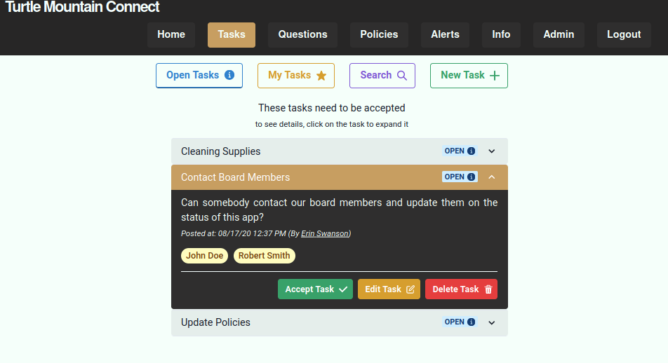
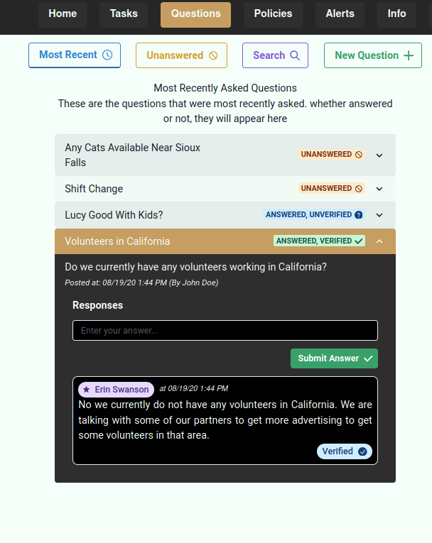
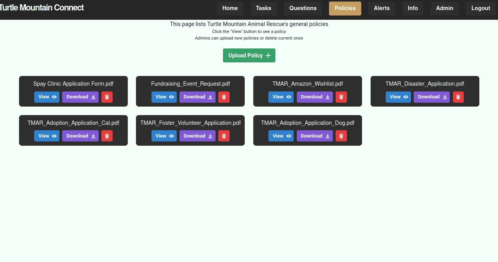
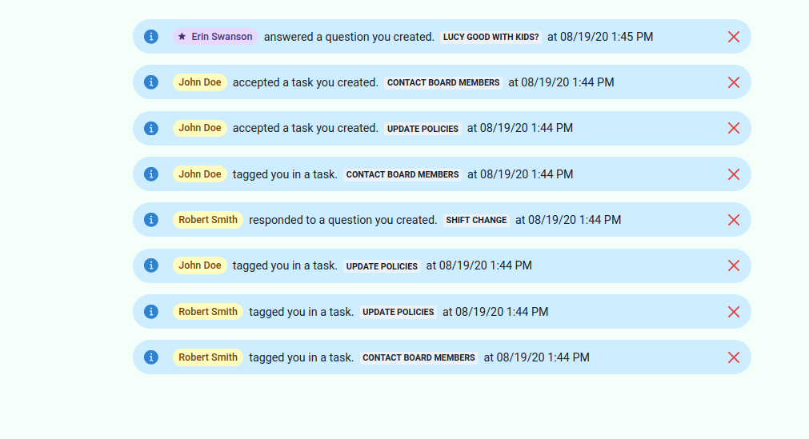

# Turtle Mountain Connect

Turtle Mountain Connect is a centralized comminucation hub for all volunteers and employees of Turtle Mountain Animal Rescue. It allows for easy access to Questions and Answers, task management, policy viewing, and a notifications page.

## Try it out!

Our application has an Information page, which allows you to experiment with our features without consequence.

## Member Privacy

Access to the application will require administrative approval, so private information from volunteers (names and potentially locations) can't be seen by just anyone.

## Responsive Design

Our app is compatible with most devices, from mobile phone to tablet to computer. As each device's screen size is different, the layout of the app will change to fit screen size, so the user always has optimal experience.

## Our Pages

### Tasks

By Default, a user will be taken to the 'open' tasks page. These are tasks that have yet to be accepted or completed.

- Anyone can accept a task that is open, but tagged users will receive a notification that the task exists.
- Only the user who posted the task, or an admin, Can edit a given task
- When a task is accepted, it will be automatically removed from the 'open tasks' section

### Questions

The questions page is for open-ended questions, these are intended to receive a response once posted.

- Questions can take multiple responses, but only one 'verified response'.
- Either the person who posted the question or an Administrator can mark a response as 'verified'
- the 'Unanswered Questions' page contains all questions without 'verified' responses, regardless of if there are responses to the question

### Policies

The policies page is used for ease of access to organization policies. Administrators can upload or view policies. Other members can only view them.

### Alerts

This page will display all notifications for a user, from newest to oldest.

- alerts will display a user tag containing the user who did the action
- alerts will also display a preview of what was responded to.
- you can delete an alert by clicking the red X on the right side of the alert
